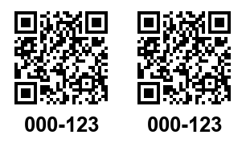

# order2homebox

Turn **Amazon / AliExpress / Temu orders into [Homebox](https://homebox.software) inventory items** — and print their QR labels on a **Brother QL-500** in one flow.

Enter an order number, review the scraped items, pick (or create) a storage location, click *Create in Homebox* — and a 29 mm label with two QR codes and the asset ID comes out of the printer.



## Features

- 🔎 **Order scraping** — one self-contained scraper per shop (Playwright + your
  browser session cookies). When a shop changes its page, you only fix one file.
- ✏️ **Review before create** — every scraped item is editable; locations are read
  live from Homebox and new locations can be created inline.
- 🏷️ **QR labels** — DK-22211 (29 mm endless), exactly 306 px wide, two identical
  QR codes side by side (cut in half → two labels per asset), optional asset ID
  text. QR content is Homebox's native `…/a/{asset_id}` deep link.
- 🖨️ **Print agent** on a Raspberry Pi (Brother QL-500 via USB, `brother_ql`),
  secured with an API key; dry-run mode for development without a printer.
- 🍎 **Apple-style web UI** with dark mode, German/English toggle and a
  single-user login.
- 📦 **One-command installs** — Proxmox host script that creates the LXC,
  standalone in-container installer, Raspberry Pi installer, and quick
  `update.sh` scripts for both.

## Architecture

```
┌─ Proxmox LXC ────────────────────────┐      ┌─ Raspberry Pi ─────────────┐
│ server (FastAPI, port 8000)          │ HTTP │ print agent (port 8010)    │
│  Web UI · scrapers (Playwright +     │─────▶│  brother_ql → /dev/usb/lp0 │
│  imported cookies) · label renderer  │      │  QL-500, DK-22211          │
└───────────┬──────────────────────────┘      └────────────────────────────┘
            │ REST (Bearer)
            ▼
        Homebox API
```

The app keeps no database — Homebox stays the single source of truth. The only
local state is the imported shop cookies under `data/`.

## Installation

### 1. Server (Proxmox)

On the Proxmox **host**, as root:

```sh
bash -c "$(curl -fsSL https://raw.githubusercontent.com/skyhell/order2homebox/main/install/proxmox-install.sh)"
```

The script asks for container settings (ID, storage, …) and application settings
(Homebox URL/credentials, web login), creates a Debian 12 LXC (2 vCPU / 2 GB RAM
recommended — headless Chromium), installs everything and prints the URL.

Already have a Debian LXC/VM? Run `install/install-in-lxc.sh` inside it instead.

### 2. Print agent (Raspberry Pi)

Connect the QL-500 via USB, then on the Pi:

```sh
sudo bash -c "$(curl -fsSL https://raw.githubusercontent.com/skyhell/order2homebox/main/printagent/deploy/install-pi.sh)"
```

Copy the printed **API key** into the server's `/opt/order2homebox/server/.env`
(`O2H_PRINT_AGENT_API_KEY=…`) and `systemctl restart order2homebox`.
Details & troubleshooting: [printagent/deploy/install-pi.md](printagent/deploy/install-pi.md).

### 3. Shop cookies

The shops have no public order API, so the app fetches your order pages with a
headless browser using your session:

1. Log in to the shop in your normal browser.
2. Export the cookies as JSON with the [Cookie-Editor](https://cookie-editor.com/)
   extension (Export → JSON).
3. Paste them on the app's **Settings** page.

When a session expires, the app tells you exactly which shop needs fresh cookies.
Cookies are stored only on your server (`data/cookies/`, mode 600).

## Updating

```sh
# in the LXC (or: pct exec <CTID> -- bash /opt/order2homebox/install/update.sh)
bash /opt/order2homebox/install/update.sh

# on the Raspberry Pi
sudo bash /opt/order2homebox/printagent/deploy/update-pi.sh
```

Both scripts pull, reinstall dependencies only when needed, restart the service
and run a health check. `.env` and `data/` are never touched.

## Configuration

Everything is configured via `.env` (prefix `O2H_`) — see
[server/.env.example](server/.env.example). Notable options:

| Variable | Meaning |
| --- | --- |
| `O2H_HOMEBOX_PUBLIC_URL` | URL encoded in QR codes if it differs from the API URL (reverse proxy) |
| `O2H_LABEL_QR_PER_ROW` | 1–3 QR codes across the 29 mm width (default 2) |
| `O2H_LABEL_SHOW_ASSET_ID` | print the asset ID under each QR (default true) |
| `O2H_AMAZON_DOMAIN` | e.g. `www.amazon.de` / `www.amazon.com` |

Label geometry details: [docs/label-layout.md](docs/label-layout.md).

### Encrypting secrets in `.env`

The web-login password is stored as a one-way bcrypt hash, but the Homebox
password (and the print-agent key) must be usable in clear text at runtime, so
they cannot be hashed. You can still keep them out of a plain-text `.env`:

```sh
cd server
python -m app.encrypt            # prompts for the secret, prints an enc:… token
```

Paste the `enc:…` value into `O2H_HOMEBOX_PASSWORD` (or
`O2H_PRINT_AGENT_API_KEY`) and restart the service. The Fernet key lives in
`server/data/secret.key` (chmod 600), **never** in `.env` — so a leaked or
committed `.env` alone does not reveal the password. Fresh installs done with
`install-in-lxc.sh` encrypt these values automatically. Plain-text values keep
working, so this is opt-in.

> Note: this protects against accidental disclosure (backups, git, sharing the
> file), not against an attacker who already has read access to the container —
> they can read the key file too.

## Development

```sh
# server
cd server
pip install -e ".[dev]"
pytest                      # scrapers, label renderer, Homebox client, auth
uvicorn app.main:app --reload

# print agent without a printer
cd printagent
pip install -e .
O2H_DRY_RUN=1 uvicorn printagent.main:app --port 8010   # writes PNGs instead
```

### When a shop changes its page

Each scraper is one file with all URL templates and CSS selectors as constants at
the top: [`server/app/scrapers/amazon.py`](server/app/scrapers/amazon.py),
[`aliexpress.py`](server/app/scrapers/aliexpress.py),
[`temu.py`](server/app/scrapers/temu.py). Adjust the selectors, update the HTML
fixture in `server/tests/fixtures/`, run `pytest`.

## Security notes

- The web UI has a single-user login (bcrypt + signed session cookie) and is
  meant for your **LAN / VPN** — don't expose it to the internet.
- Shop cookies grant access to your shop accounts; they never leave the server.
- The print agent only accepts requests with the shared API key.

## License

[MIT](LICENSE)
