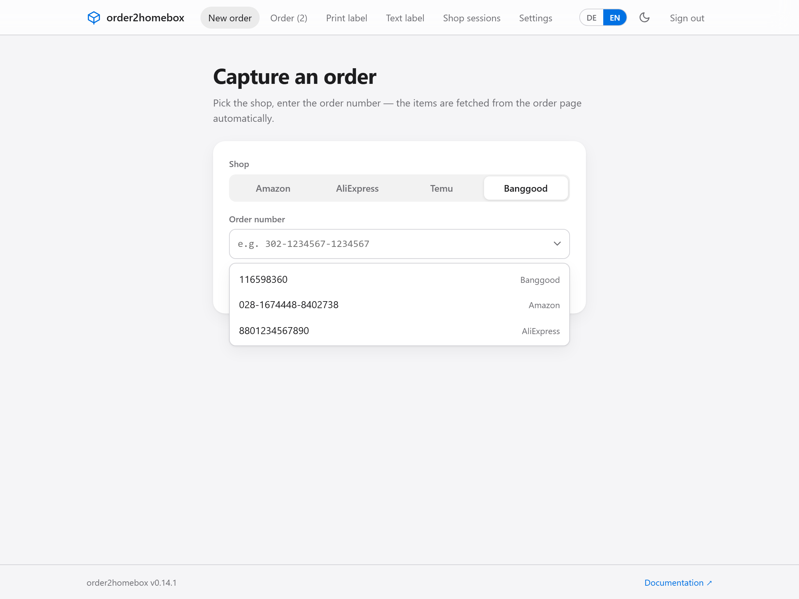
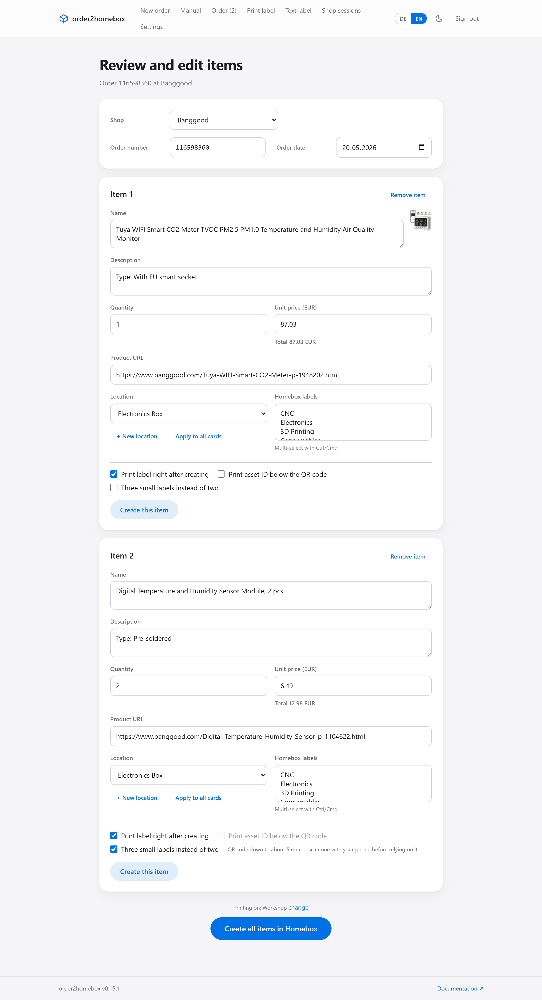
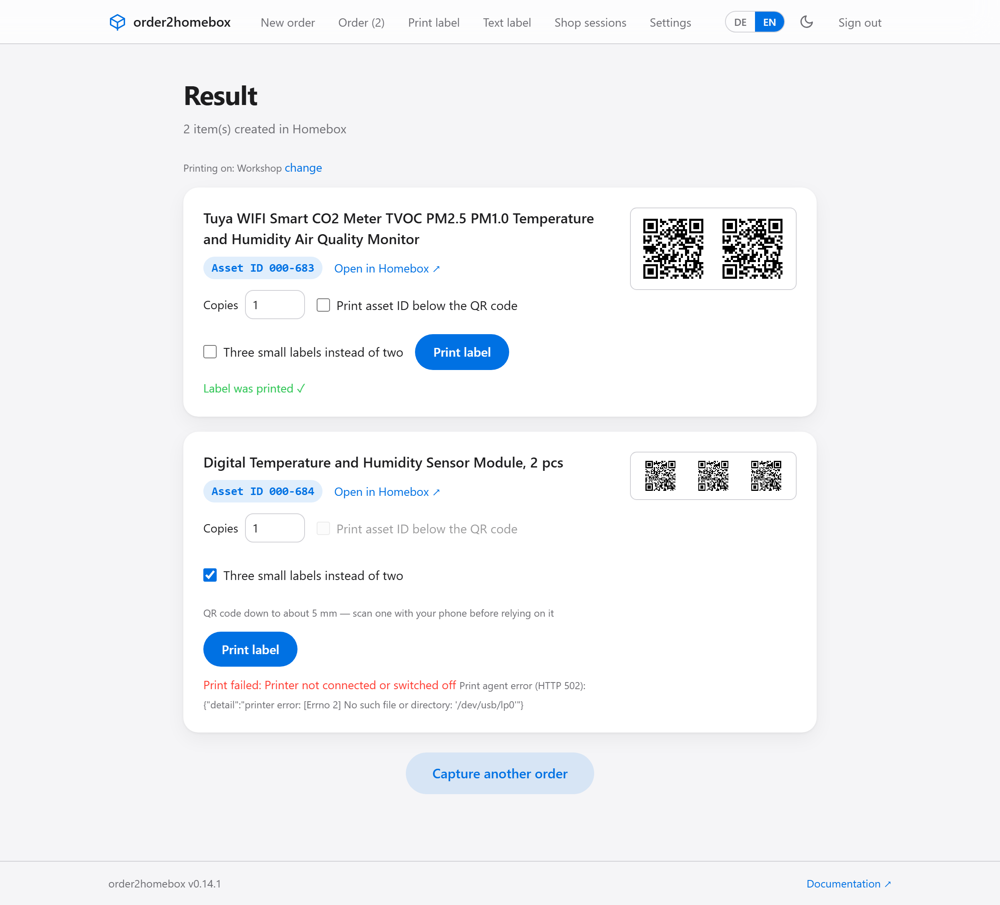
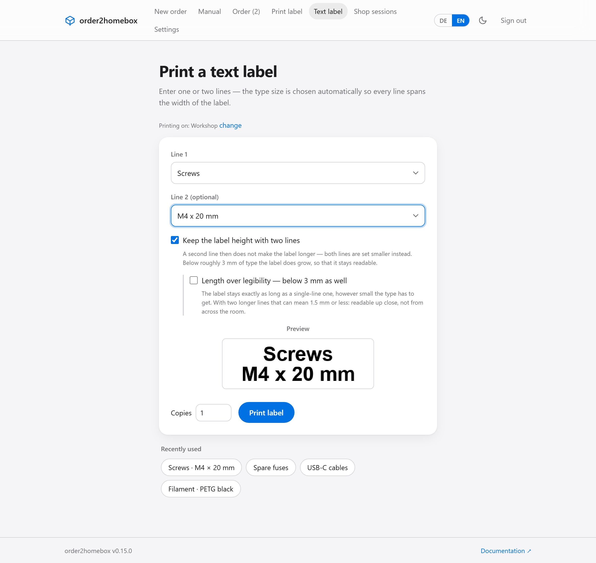
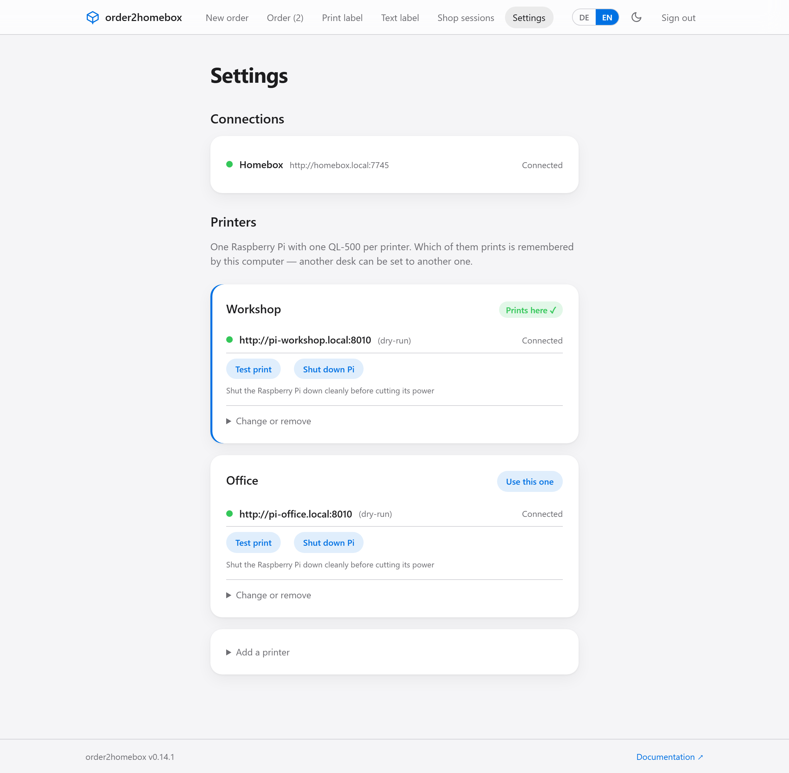

# order2homebox

Turn **Amazon / AliExpress / Temu / Banggood orders into [Homebox](https://homebox.software) inventory items** — and print their QR labels on a **Brother QL-500** in one flow.

Enter an order number, review the scraped items, pick (or create) a storage location, click *Create in Homebox* — and a 29 mm label with two QR codes and the asset ID comes out of the printer.


## Features

- 🔎 **Order scraping** — one self-contained scraper per shop (Playwright + your
  browser session cookies). When a shop changes its page, you only fix one file.
- ✏️ **Review before create** — every scraped item is editable; locations are read
  live from Homebox and new locations can be created inline. The location you
  last used is pre-selected for every item of the next order, and one button
  applies a card's location to all the other cards — an order usually goes to
  one and the same place.
- 🏷️ **QR labels** — DK-22211 (29 mm endless), exactly 306 px wide, two identical
  QR codes side by side (cut in half → two labels per asset), optional asset ID
  text — switchable per item right on its card, so a single item can get a bare
  QR label without changing the default. Small parts you have several of can be
  printed three-up instead, which drops the asset ID for want of room. QR content
  is Homebox's native `…/a/{asset_id}` deep link.
- 🔗 **Reprint from a link** — paste any Homebox link (an `…/a/{asset_id}` deep
  link, an `…/item/{uuid}` page URL, or just an asset ID like `000-629`) on the
  *Print label* page and reprint its QR label without going through an order,
  with the same asset-ID and three-up choices an item card offers.
- ✍️ **Text labels** — a *Text label* page for everything that is not a Homebox
  item: one or two lines, no QR code. The type size is derived from the text so
  every line spans the tape width, a live preview shows the real rendering, and
  the labels you last printed come back as one-click chips. Two checkboxes
  decide what a second line costs in tape: full-size type on a longer label,
  the height of a single-line label in smaller type, or that same height at any
  type size at all.
- 🖨️ **Print agent** on a Raspberry Pi (Brother QL-500 via USB, `brother_ql`),
  secured with an API key; dry-run mode for development without a printer.
- ⏻ **Shut the Pi down from the web UI** — the print agent is headless, so the
  settings page has a confirmed *Shut down Pi* button instead of you having to
  pull the plug (and eventually corrupt the SD card). The connection rows keep
  themselves up to date, and the printer controls disappear while the agent is
  unreachable.
- 🍎 **Apple-style web UI** with dark mode, German/English toggle and a
  single-user login.
- 📦 **One-command installs** — Proxmox host script that creates the LXC,
  standalone in-container installer, Raspberry Pi installer, and quick
  `update.sh` scripts for both.

## Screenshots

| Capture an order | Review & edit |
| --- | --- |
| [](docs/screenshot-new-order.png) | [](docs/screenshot-edit.png) |

Pick a shop and enter the order number; the scraped items are shown for review —
name, price, quantity, storage location and Homebox labels — before they are
created in Homebox and their QR labels printed. Correcting a quantity re-splits
the price the order actually charged, and each item decides for itself whether
its label carries the asset ID or three codes instead of two.



Afterwards every item has its asset ID, a preview of the label that was printed
and a button to print it again — more copies, with or without the ID. Each card
has exactly one line saying what printing did, and every attempt replaces the
one before it, so the card never shows a failure the reprint has long since
fixed. A printer that is off or unplugged is named as such, with the print
agent's own wording kept behind it.



The *Text label* page prints one or two lines without a QR code. The preview is
the real rendering the printer gets, and the texts you last printed come back as
one-click chips.



The settings page shows the Homebox and print-agent connection status and holds
the per-shop session cookies.

## Architecture

```
┌─ Proxmox LXC ────────────────────────┐      ┌─ Raspberry Pi ─────────────┐
│ server (FastAPI, port 8000)          │ HTTP │ print agent (port 8010)    │
│  Web UI · scrapers (Playwright +     │─────▶│  brother_ql → /dev/usb/lp0 │
│  imported cookies) · label renderer  │      │  QL-500, DK-22211          │
└───────────┬──────────────────────────┘      └────────────────────────────┘
            │ REST (Bearer)
            ▼
        Homebox API
```

The app keeps no database — Homebox stays the single source of truth. The only
local state is the imported shop cookies under `data/`.

## Installation

### 1. Server (Proxmox)

On the Proxmox **host**, as root:

```sh
bash -c "$(curl -fsSL https://raw.githubusercontent.com/skyhell/order2homebox/main/install/proxmox-install.sh)"
```

The script asks for container settings (ID, storage, …) and application settings
(Homebox URL/credentials, web login), creates a Debian 12 LXC (2 vCPU / 2 GB RAM
recommended — headless Chromium), installs everything and prints the URL.

Already have a Debian LXC/VM? Run `install/install-in-lxc.sh` inside it instead.

### 2. Print agent (Raspberry Pi)

Connect the QL-500 via USB, then on the Pi:

```sh
sudo bash -c "$(curl -fsSL https://raw.githubusercontent.com/skyhell/order2homebox/main/printagent/deploy/install-pi.sh)"
```

Copy the printed **API key** into the server's `/opt/order2homebox/server/.env`
(`O2H_PRINT_AGENT_API_KEY=…`), point `O2H_PRINT_AGENT_URL` at the Pi and
`systemctl restart order2homebox`. Give the Pi a DHCP reservation first, so that
address keeps working after a reboot.
Details & troubleshooting: [printagent/deploy/install-pi.md](printagent/deploy/install-pi.md).

### 3. Shop cookies

The shops have no public order API, so the app fetches your order pages with a
headless browser using your session:

1. Log in to the shop in your normal browser.
2. Export the cookies as JSON with the [Cookie-Editor](https://cookie-editor.com/)
   extension (Export → JSON).
3. Paste them on the app's **Settings** page.

When a session expires, the app tells you exactly which shop needs fresh cookies.
Cookies are stored only on your server (`data/cookies/`, mode 600).

## Updating

```sh
# in the LXC (or: pct exec <CTID> -- bash /opt/order2homebox/install/update.sh)
bash /opt/order2homebox/install/update.sh

# on the Raspberry Pi
sudo bash /opt/order2homebox/printagent/deploy/update-pi.sh
```

Both scripts pull, reinstall dependencies only when needed, restart the service
and run a health check. `.env` and `data/` are never touched.

What changed in each version: [CHANGELOG.md](CHANGELOG.md). The print agent only
needs updating when a release says so.

## Configuration

Everything is configured via `.env` (prefix `O2H_`) — see
[server/.env.example](server/.env.example). Notable options:

| Variable | Meaning |
| --- | --- |
| `O2H_HOMEBOX_PUBLIC_URL` | URL encoded in QR codes if it differs from the API URL (reverse proxy) |
| `O2H_LABEL_QR_PER_ROW` | 1–3 QR codes across the 29 mm width (default 2) |
| `O2H_LABEL_SHOW_ASSET_ID` | print the asset ID under each QR (default false) |
| `O2H_AMAZON_DOMAIN` | e.g. `www.amazon.de` / `www.amazon.com` |

Label geometry details: [docs/label-layout.md](docs/label-layout.md).

### Encrypting secrets in `.env`

The web-login password is stored as a one-way bcrypt hash, but the Homebox
password (and the print-agent key) must be usable in clear text at runtime, so
they cannot be hashed. You can still keep them out of a plain-text `.env`:

```sh
cd server
python -m app.encrypt            # prompts for the secret, prints an enc:… token
```

Paste the `enc:…` value into `O2H_HOMEBOX_PASSWORD` (or
`O2H_PRINT_AGENT_API_KEY`) and restart the service. The Fernet key lives in
`server/data/secret.key` (chmod 600), **never** in `.env` — so a leaked or
committed `.env` alone does not reveal the password. Fresh installs done with
`install-in-lxc.sh` encrypt these values automatically. Plain-text values keep
working, so this is opt-in.

**Converting an existing installation.** `update.sh` never touches `.env`, so an
installation older than that automation keeps its plain text. One command
converts both secrets in place:

```sh
pct exec <CTID> -- bash /opt/order2homebox/install/encrypt-env.sh
```

It writes `.env.bak`, rewrites only the two secret lines — comments, order and
every other value stay byte-identical — and refuses to touch the file unless
each new token decrypts back to exactly what was there. Then it restarts the
service and checks `/health`. Running it again does nothing.

`/health` only proves the service *started*. Open the settings page: the Homebox
row has to stay green (that is the decrypted password logging in — the client
connects lazily, so nothing before this point exercised it) and a test print
proves the print-agent key. If either fails, roll back with
`cp .env.bak .env && systemctl restart order2homebox`.

**Then delete the backup** — `shred -u .env.bak`. It still holds the secrets in
plain text next to the file that was just encrypted, so until it is gone the
next snapshot or backup carries the password anyway.

Afterwards the app **needs** `server/data/secret.key` to start. Back it up along
with `.env`, but keep the two apart: either one alone is useless, which is the
whole point.

**Changing the Homebox password.** Change it in Homebox first, then hand the new
one over — the encrypted value in `.env` cannot simply be edited:

```sh
pct enter <CTID>                                            # not pct exec: it needs a terminal
bash /opt/order2homebox/install/set-homebox-password.sh
```

It asks twice without echoing, **logs into Homebox with the new password before
touching `.env`** — a typo is refused at the prompt instead of taking the app
down at the next restart — then encrypts it with the existing key file, replaces
the line and restarts the service. The password never reaches the shell history
or the process list, and no plain-text backup is left behind. Add `--no-verify`
(as an argument to `python -m app.set_secret`) to set it while Homebox is
unreachable.

The same command sets the print-agent key:
`python -m app.set_secret O2H_PRINT_AGENT_API_KEY` from `server/`.

> Note: this protects against accidental disclosure (backups, git, sharing the
> file), not against an attacker who already has read access to the container —
> they can read the key file too.

## Development

```sh
# server
cd server
pip install -e ".[dev]"
pytest                      # scrapers, label renderer, Homebox client, auth
uvicorn app.main:app --reload

# print agent without a printer
cd printagent
pip install -e .
O2H_DRY_RUN=1 uvicorn printagent.main:app --port 8010   # writes PNGs instead
```

### When a shop changes its page

Each scraper is one file with all URL templates and CSS selectors as constants at
the top: [`server/app/scrapers/amazon.py`](server/app/scrapers/amazon.py),
[`aliexpress.py`](server/app/scrapers/aliexpress.py),
[`temu.py`](server/app/scrapers/temu.py),
[`banggood.py`](server/app/scrapers/banggood.py). Adjust the selectors, update the HTML
fixture in `server/tests/fixtures/`, run `pytest`.

## Security notes

- The web UI has a single-user login (bcrypt + signed session cookie) and is
  meant for your **LAN / VPN** — don't expose it to the internet.
- Shop cookies grant access to your shop accounts; they never leave the server.
- The print agent only accepts requests with the shared API key.

## License

[MIT](LICENSE)
